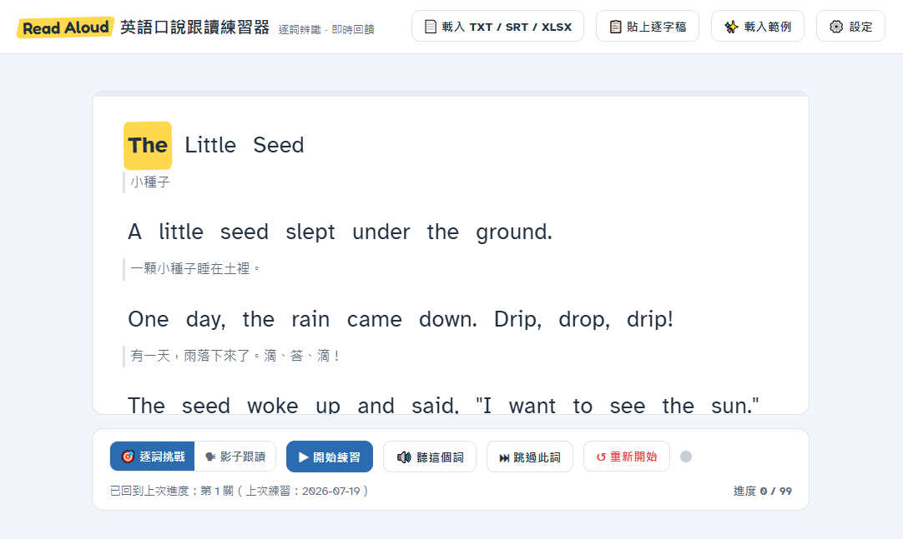

# Read Aloud 英語口說跟讀練習器

一個免安裝、免金鑰、單一 HTML 檔的英語口說練習工具。載入課文或影片字幕後，學生對著麥克風逐詞朗讀，唸對自動前進、唸錯示範發音，練完提供錄音回放與卡關發音學習卡。專為國小英語課堂設計。

## 功能特色

- **四種文本來源**：TXT 純文字、SRT 字幕檔、Language Reactor 匯出的 XLSX（含中文翻譯對照）、YouTube「顯示轉錄稿」貼上匯入
- **逐詞辨識推進**：Web Speech API 即時辨識，唸對的詞變綠色、螢光筆高亮自動前進，可點擊任意詞跳著練
- **容錯設計**：比對彈性可調（60%~100%），自動處理大小寫、標點、縮寫（I'm = I am）、數字（2 = two）、同音詞（to / two / too）
- **示範發音**：唸錯達設定次數自動慢速示範（語速可調），也可隨時按「聽這個詞」
- **自動併句**：字幕斷行自動重組為完整句子，中文翻譯跟隨對應句子顯示
- **字數關卡制**：長文自動切關（預設每關約 150 字），關卡列顯示星等、可跳關重練
- **練習結果**：完成字數鼓勵語、本關錄音回放與下載、卡關發音學習卡（可展開常用片語跟唸）
- **進度記憶**：關卡進度與星等自動儲存於瀏覽器，下次開啟同一篇文章接續練習

## 部署到 GitHub Pages

1. 在 GitHub 建立新儲存庫（Repository），例如 `read-aloud`，設為 **Public**
2. 將 `英語口說跟讀練習器.html` **改名為 `index.html`** 後上傳（Add file → Upload files）
   - 改名為 index.html 的好處：網址乾淨（`https://帳號.github.io/read-aloud/`），且避免中文檔名在網址中變成一長串編碼
3. 進入儲存庫的 **Settings → Pages**，Source 選擇 `Deploy from a branch`，Branch 選 `main`、資料夾選 `/ (root)`，按 Save
4. 等待 1~2 分鐘，頁面上方會出現網站網址，即可分享給學生

**更新版本**：直接在儲存庫中上傳同名檔案覆蓋（或以 GitHub 網頁編輯器貼上新內容），Commit 後約 1 分鐘生效。學生若看到舊版，請按 `Ctrl + F5` 強制重新整理。

**本機使用**：不部署也可以——下載 HTML 檔後直接用 Chrome 開啟即可，功能完全相同（進度記憶綁定該台電腦）。

## 使用說明

### 載入文本

| 來源 | 操作方式 | 中文翻譯 | 適用情境 |
|---|---|---|---|
| TXT | 載入 TXT / SRT / XLSX | 無 | 課本課文、自編教材 |
| SRT | 載入 TXT / SRT / XLSX | 無 | 影片字幕檔 |
| XLSX | 載入 TXT / SRT / XLSX | **有**（C 欄） | Language Reactor 匯出（B 欄英文、C 欄翻譯） |
| YouTube 逐字稿 | 貼上逐字稿 | 無 | 影片頁「顯示轉錄稿」→ 全選複製 → 貼上，時間戳自動去除 |

> 提醒：YouTube 純自動產生的字幕常缺少標點，「自動併句」會無從斷句；此時建議到設定中關閉自動併句，改用原始斷行練習。

### 練習流程

1. 按「**▶ 開始練習**」並允許麥克風權限
2. 對麥克風唸出**黃色螢光筆**標記的詞，唸對自動前進（可連續順唸）
3. 唸錯達設定次數會閃紅並自動示範正確發音，跟著唸一次再繼續；卡住可按「**⏭ 跳過此詞**」
4. 完成一關後查看結果：鼓勵語、錄音回放、卡關發音學習卡（點卡片展開常用片語），按「**下一關 ▶**」繼續

### 設定選項

| 選項 | 預設 | 說明 |
|---|---|---|
| 比對容許彈性 | 標準 80% | 100% 需完全相同；80% 允許小差異並啟用同音容錯；60% 發音接近即可 |
| 唸錯幾次後示範發音 | 2 次 | 達次數自動播放慢速示範 |
| 示範發音語速 | 0.8x | 國小建議 0.7x~0.8x |
| 每關練習字數 | 150 字 | 60~300 字，於句子結尾處分關；調整後重新分關並清除本篇星等 |
| 自動併句 | 依來源 | XLSX / SRT / 逐字稿預設開啟，TXT 預設關閉 |
| 辨識口音 | en-US | 依教材口音選擇美式／英式／澳洲 |

## 系統需求與限制

- **瀏覽器**：電腦版 **Chrome 或 Edge**（語音辨識支援最完整）；iPad / iPhone 的 Safari 支援不穩定，不建議
- **網路**：語音辨識與片語查詢需連網（語音由瀏覽器送至 Google 伺服器辨識）
- **麥克風**：首次使用需允許權限；建議安靜環境，班級同時使用時彼此間隔或戴耳麥
- **辨識準確度**：對兒童聲音與非母語口音辨識率會打折，屬 Web Speech API 的先天限制——這正是「容許彈性」存在的原因，可視班級狀況調寬
- **發音回饋顆粒度**：只能判斷「這個詞未通過」並示範整詞唸法，無法指出是哪個音素唸錯

## 資料與隱私

- 語音辨識由瀏覽器內建服務處理（送至 Google 伺服器），本工具**不會**將語音上傳到任何自架伺服器
- 練習錄音只存在使用者的瀏覽器記憶體中，關閉頁面即消失，除非自行按「下載錄音檔」保存
- 進度與星等以 localStorage 存在**該台電腦的該瀏覽器**中，不會跨裝置同步；無痕模式不會保存
- 學習卡的片語查詢使用免費的 [Datamuse API](https://www.datamuse.com/api/)，僅送出查詢的英文單字

## 常見問題

**Q：按開始後麥克風沒反應？**
點網址列左側的鎖頭／設定圖示，將麥克風權限改為「允許」後重新按開始。本機直接開啟 HTML 檔若被擋，改用 GitHub Pages 網址開啟即可。

**Q：明明唸對了卻判錯？**
先到設定把「比對容許彈性」調寬（例如 70%）；確認辨識口音與教材相符；環境噪音大時辨識率會明顯下降。

**Q：某個詞怎麼唸都過不了？**
專有名詞或特殊詞彙偶爾會辨識不出來，按「跳過此詞」即可，它會被列入卡關學習卡供課後加強。

**Q：併句之後翻譯的位置怪怪的？**
機器翻譯是照原始斷行切的，重新併句後句界附近的翻譯會略有位移，屬資料先天限制。

**Q：學生換電腦後進度不見了？**
進度存在原本那台電腦的瀏覽器中，屬預期行為。需要跨裝置進度請於課堂上以同一批裝置固定使用。

## 致謝

- 語音辨識與合成：Web Speech API
- XLSX 解析：[SheetJS](https://sheetjs.com/)
- 常用片語資料：[Datamuse API](https://www.datamuse.com/api/)
- 字型：Fredoka、Atkinson Hyperlegible（Google Fonts）

---

以單一 HTML 檔發佈，教育用途自由使用與修改。
